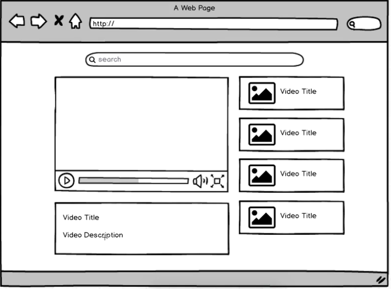
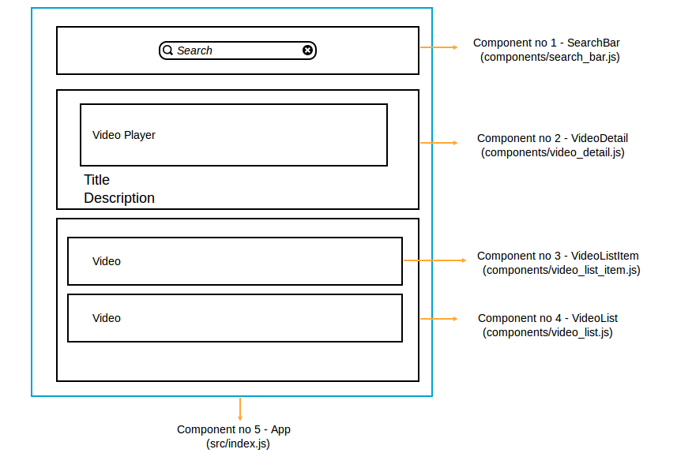

m ## video-search-youtube
Video search using YouTube API build with React

## How to run this project

 - Populate API_KEY from YouTube API.
 - Go to ```console.developers.google.com```
 - Enable ```YouTubeDataAPIv3```
 - Create new credentials, Browser Key
 - Replace your API_KEY with your own


```
- clone the repo
- npm install
- npm start
```

## Project structure



In ```src``` folder there are all the components.



## How to start with React (Notes)

Start from creating functional, stateless components and later refactor components once the application have more functionality into class based components.

Functional (stateless) component:

```js

const SearchBar = () => {
	return (
		<input />
	);
};
```

Class based component:

```js

class SearchBar extends React.Component {
	constructor(props) {
		super(props);

		this.state = {...}
	}

	render() {
	 ...
	}
}
```

Class based component must have **render** method, they also have **state object** which keeps the internal record of the component when is rendered. Official docs [Which Components should have state?](http://facebook.github.io/react/docs/interactivity-and-dynamic-uis.html#what-components-should-have-state)

All JS classes have special **constructor** function, which is the first and only function called automatically whenever **new instance of the class is created**.

Constructor function initialize variables, states.
**super(props)** is used to call methods on parent component/object.

In above example **Component** is the parent of the SearchBar component.

**this.state = {...}** is only used once in a constructor. Nowhere else. To update the state we use method: **setState()**


#### Reference
This project is based on boilerplate and tutorial by [StephenGrider](https://github.com/StephenGrider/ReduxSimpleStarter)

[ES6 Classes](http://facebook.github.io/react/docs/reusable-components.html#es6-classes)

#### Packages
youtube-api-search
lodash
